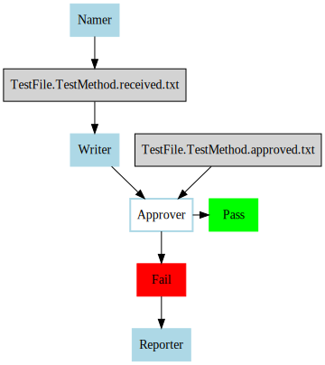

<!--
GENERATED FILE - DO NOT EDIT
This file was generated by [MarkdownSnippets](https://github.com/SimonCropp/MarkdownSnippets).
Source File: /docs/ApprovalTests/explanations/mdsource/MainConcepts.source.md
To change this file edit the source file and then run MarkdownSnippets.
-->

# Main Concepts

<!-- toc -->
## Contents

  * [Verify](#verify)
    * [What it does?](#what-it-does)
    * [How it does it?](#how-it-does-it)
    * [General usage](#general-usage)
    * [Why would you customize it?](#why-would-you-customize-it)
  * [Writers](#writers)
    * [What it does?](#what-it-does-1)
    * [How it does it?](#how-it-does-it-1)
    * [General usage](#general-usage-1)
    * [Why would you customize it?](#why-would-you-customize-it-1)
  * [Namers](#namers)
    * [What it does?](#what-it-does-2)
    * [How it does it?](#how-it-does-it-2)
    * [General usage](#general-usage-2)
    * [Why would you customize it?](#why-would-you-customize-it-2)
  * [Reporters](#reporters)
    * [What it does?](#what-it-does-3)
    * [How it does it?](#how-it-does-it-3)
    * [General usage](#general-usage-3)
    * [Why would you customize it?](#why-would-you-customize-it-3)
  * [Approval Output Files](#approval-output-files)
    * [What it does?](#what-it-does-4)
    * [How it does it?](#how-it-does-it-4)
    * [General usage](#general-usage-4)
    * [Why would you customize it](#why-would-you-customize-it)<!-- endToc -->


## Verify


### What it does?

The entry point to ApprovalTests is almost always some variation of a [Verify method](../Verify.md).  
These helper methods make it easy to test many common scenarios.

This method will:

1. Serialize the object passed to it to the `.received.` file
1. Compare it to the `.approved.` file
1. Launch a DiffTool on failure


### How it does it?

Let's take the example:

<!-- snippet: simple_verify -->
<a id='snippet-simple_verify'></a>
```cs
[Test]
public void Text()
{
    Approvals.Verify("should be approved");
}
```
<sup><a href='/src/ApprovalTests.Tests/ApprovalsTest.cs#L6-L12' title='Snippet source file'>snippet source</a> | <a href='#snippet-simple_verify' title='Start of snippet'>anchor</a></sup>
<!-- endSnippet -->

This call brings together 3 things + default Approver to produce a `.received.` file which is compared to an `.approved.` file.



**Note:** This is a simplified version of what ApprovalTests does. You can see a [full picture here](MainConceptsComplete.svg)


### General usage

You will be using a Verify calls all the time with the ApprovalTests.
The more complicated the object you are trying to test, the more you will want to use a Verify.


### Why would you customize it?

It is fairly common to make a custom Verify call.
Anytime you find a repeated block

```cs
// Do something to an Object
// Print an Object ToString
// Verify the ToString
```

You will want to extract a custom Verify helper method

```cs
public static void VerifyMyObject(MyObject o)
{
    // Do something to an Object
    // Print an Object ToString
    // Verify the ToString
} 
```

**Note:** Because ApprovalTests allow testing of whole objects, you will often find this type of duplication showing more often than a traditional Unit Testing. This is because developers usually add extra complexity to their test scenarios to make results easier to test with a assert. This traditional complexity makes the duplication hard to see. All of the [Verify methods](../Verify.md) were created by following the above pattern.


## Writers


### What it does?

[Writers](https://github.com/approvals/ApprovalTests.Net/blob/master/src/ApprovalTests/Core/IApprovalWriter.cs) are responsible for writing the `.received.` file to the disk.
They also determine the extension for both `.received.` and `.approved.` files.


### How it does it?

Eventually, all Verify methods call:
<!-- snippet: complete_verify_call -->
<a id='snippet-complete_verify_call'></a>
```cs
public static void Verify(IApprovalWriter writer, IApprovalNamer namer, IApprovalFailureReporter reporter)
```
<sup><a href='/src/ApprovalTests/Approvals.cs#L42-L44' title='Snippet source file'>snippet source</a> | <a href='#snippet-complete_verify_call' title='Start of snippet'>anchor</a></sup>
<!-- endSnippet -->

Most of the time this is hidden in an underlying a Verify call.


### General usage

The vast majority of the time you will not interact directly with the Writers.


### Why would you customize it?

If you want it to approve something that writes to a new type of a binary file, you would create a custom Writer.

If you simply wanted to format text this is usually done in a separate step before calling:

<!-- snippet: verify_with_extension -->
<a id='snippet-verify_with_extension'></a>
```cs
public static void VerifyWithExtension(string text, string fileExtensionWithDot, Func<string, string> scrubber = null)
```
<sup><a href='/src/ApprovalTests/Approvals.cs#L176-L178' title='Snippet source file'>snippet source</a> | <a href='#snippet-verify_with_extension' title='Start of snippet'>anchor</a></sup>
<!-- endSnippet -->


## Namers


### What it does?

[Namers](https://github.com/approvals/ApprovalTests.Net/blob/master/src/ApprovalTests/Core/IApprovalNamer.cs) are responsible for figuring out what the `.approved.` and `.received.` files should be called and where they are located.


### How it does it?

This is primarily done by inspecting a stack trace to detect your test framework's attributes. 

The naming pattern is: `{ClassName}.{MethodName}.{AdditionalInformation(optional)}.approved.{Extension}`


### General usage

The vast majority of the time you will not interact directly with the Namers.


### Why would you customize it?

To **support a new testing framework** is a main reason you would create your own Namer.


## Reporters


### What it does?

[Reporters](https://github.com/approvals/ApprovalTests.Net/blob/master/src/ApprovalTests/Core/IApprovalReporter.cs) are called only on failure.
They are responsible for things such as opening Diff tools, copying commands to your clipboard or anything else that can help you determine what went wrong and so you can fix it.


### How it does it?

Reporters are very simple. They are called with a received and approved file names on failure. Usually, they make a call to a command line using these filenames as parameters.

For example: `YourDiffTool filename1 filename2`


### General usage

It is very common to switch between Reporters for both personal preferences (a preferred Diff tool) and contextual preferences (at this moment I want to...).

Because using the right Reporter at the right time is so important, there are multiple places they can be configured, including which Reporter is the default Reporter.


### Why would you customize it?

There are two reasons you want to write your custom Reporter:

1. To support a tool you like that is not currently supported 
1. To change the order in which Diff tools are selected


## Approval Output Files


### What it does?

The core of Approvals is that your result and expectations are saved in output files. These files allow us to verify expectations in future runs as well as use external tools.


### How it does it?

Approvals create two files:

* Actual: `ClassName.TestMethodName.received.txt`
* Expected: `ClassName.TestMethodName.approved.txt`
  
The actual files (`.received.`) are deleted on success and should never be checked on your source control.  
The expected files (`.approved.`) need to be checked into your source control.


### General usage

Every ApprovalTest will be generating these files.


### Why would you customize it

The two main ways of customizing the output files are:

1. To store all the output files in the subdirectory
1. Adding additional information for Data Driven Tests or [machine specific tests](../EnvironmentSpecificTests.md)


[Back to User Guide](../readme.md#top)
