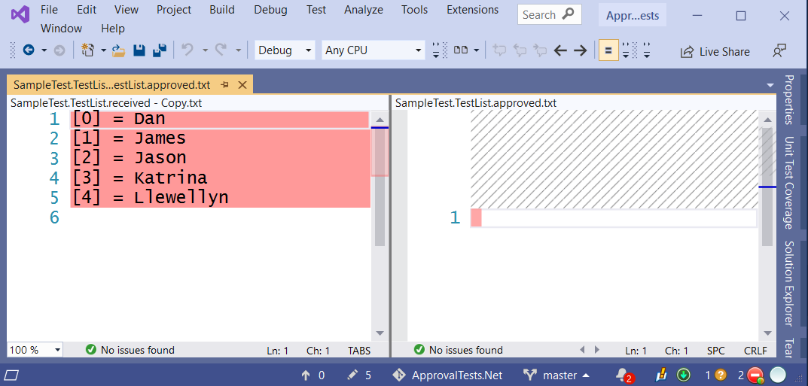
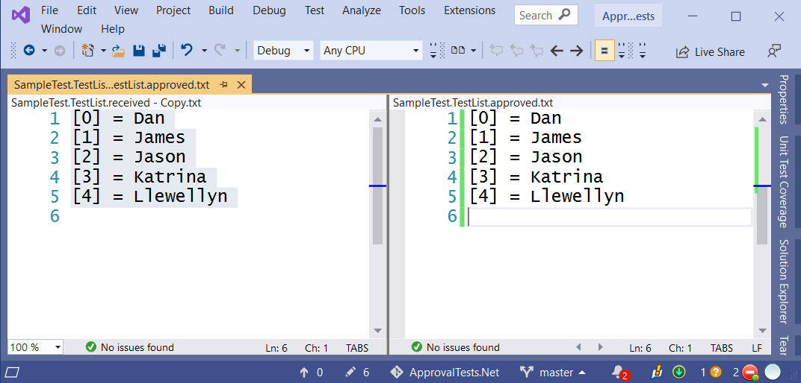

<!--
GENERATED FILE - DO NOT EDIT
This file was generated by [MarkdownSnippets](https://github.com/SimonCropp/MarkdownSnippets).
Source File: /readme.source.md
To change this file edit the source file and then run MarkdownSnippets.
-->

#  ApprovalTests

[](https://ci.appveyor.com/project/isidore/approvaltests-net)
[](https://opensource.org/licenses/Apache-2.0)
[](https://www.nuget.org/packages/ApprovalTests/)
[](#backers)
[](#sponsors)

Capturing Human Intelligence - ApprovalTests is an open source assertion/verification library to aid unit testing.

It is compatible with most .Net unit testing frameworks (Nunit, MsTest, xUnit, MBUnit)

<!-- toc -->
## Contents

  * [What can it be used for?](#what-can-it-be-used-for)
  * [Video Tutorials](#video-tutorials)
  * [Podcasts](#podcasts)
  * [Docs](#docs)
  * [Available on NuGet](#available-on-nuget)
  * [Examples](#examples)
    * [Verifying a List](#verifying-a-list)
  * [Approved File Artifacts](#approved-file-artifacts)
  * [More Info](#more-info)
  * [Questions?](#questions)
  * [Credits](#credits)
    * [Contributors](#contributors)
    * [Backers](#backers)
    * [Sponsors](#sponsors)<!-- endToc -->


## What can it be used for?

Approval Tests can be used for verifying objects that require more than a simple assert. They also come prepackaged with utilities for some common .Net scenarios including:

 * Dictionaries & Collections
 * Long Strings
 * Log Files
 * [Asp.Net](https://github.com/approvals/Approvals.Net.Asp)
 * [Asp.Net Mvc](https://github.com/approvals/Approvals.Net.Asp)
 * [Winforms](https://github.com/approvals/ApprovalTests.Net.WinForms)
 * [Wpf](https://github.com/approvals/ApprovalTests.Net.Wpf)
 * [Entity Framework](https://github.com/approvals/ApprovalTests.Net.EntityFramework)
 * [Rdlc reports](https://github.com/approvals/ApprovalTests.Net.Rdlc)


## [Video Tutorials](http://www.youtube.com/playlist?list=PL0C32F89E8BBB5368)

You can watch a bunch of short videos on getting started and [using ApprovalTests in .Net](http://www.youtube.com/playlist?list=PL0C32F89E8BBB5368) at YouTube


## Podcasts

If you prefer auditory learning, you might enjoy the following podcast

 * [This Agile Life](http://www.thisagilelife.com/46/)
 * [Hanselminutes](http://www.hanselminutes.com/360/approval-tests-with-llewellyn-falco)
 * [Herding Code](http://www.developerfusion.com/media/122649/herding-code-117-llewellyn-falcon-on-approval-tests/)


## Docs

 * [ApprovalTests](docs/ApprovalTests/readme.md)
 * [ApprovalUtilities](docs/ApprovalUtilities/readme.md)


## Available on NuGet

[Install-Package ApprovalTests](http://nuget.org/packages/ApprovalTests)


## Examples


### Verifying a List

<!-- snippet: sample_test -->
<a id='d921639c'></a>
```cs
[UseReporter(typeof(VisualStudioReporter))]
[TestFixture]
public class SampleTest
{
    [Test]
    public void TestList()
    {
        var names = new[] {"Llewellyn", "James", "Dan", "Jason", "Katrina"};
        Array.Sort(names);
        Approvals.VerifyAll(names, label: "");
    }
}
```
<sup><a href='/src/ApprovalTests.Tests/SampleTest.cs#L7-L21' title='Snippet source file'>snippet source</a> | <a href='#d921639c' title='Start of snippet'>anchor</a></sup>
<!-- endSnippet -->

Will Produce a File

    `SampleTest.TestList.received.txt`

<!-- snippet: SampleTest.TestList.approved.txt -->
<a id='6760127c'></a>
```txt
[0] = Dan
[1] = James
[2] = Jason
[3] = Katrina
[4] = Llewellyn
```
<sup><a href='/src/ApprovalTests.Tests/SampleTest.TestList.approved.txt#L1-L5' title='Snippet source file'>snippet source</a> | <a href='#6760127c' title='Start of snippet'>anchor</a></sup>
<!-- endSnippet -->

It will also open these 2 files (`.received.` & `.approved.` ) in a diff editor. 



You can **approve** these results by copying everything (ctrl+a, ctrl+c) and pasting it in the right hand side (ctrl+a, ctrl+v)




In most situations, you will use one of the [supported DiffTools](docs/ApprovalTests/Reporters.md#supported-diff-tools) to examine and approve the result.

Alternatively, you can rename the `.received.` file to SampleTest.TestList.**approved**.txt and the test will now pass. 


**note:** The diff tools are **NOT** opened when the tests pass, only on failure.


## Approved File Artifacts

The `*.approved.*` files must be checked into source your source control. ApprovalTests now ignores line endings by default (so you can remove `*.approved.* binary` from your .gitattributes file if you added previously).

If you would like to verify line endings, simply add `[assembly: IgnoreLineEndingsAttribute(false)]` to your AssemblyInfo.cs

Do not add `*.received.*` files to your source control (they are transitory, and some SCMs like TFS will lock them or mark them read-only, which will break every dependent test).


## More Info

 * [Website](http://approvaltests.com/)
 * [Blog](https://approvaltests.blogspot.com/)


## Questions?

ask on twitter: [@LlewellynFalco](https://twitter.com/#!/llewellynfalco) or #ApprovalTests


## Credits


### Contributors

This project exists thanks to all the people who contribute.

<a href="graphs/contributors"></a>


### Backers

Thank you to all our backers! 🙏 [[Become a backer](https://opencollective.com/approvals#backer)]

<a href="https://opencollective.com/approvals#backers" target="_blank"></a>


### Sponsors

Support this project by becoming a sponsor. Your logo will show up here with a link to your website. [[Become a sponsor](https://opencollective.com/approvals#sponsor)]
<a href="https://opencollective.com/approvals/sponsor/0/website" target="_blank"></a>
